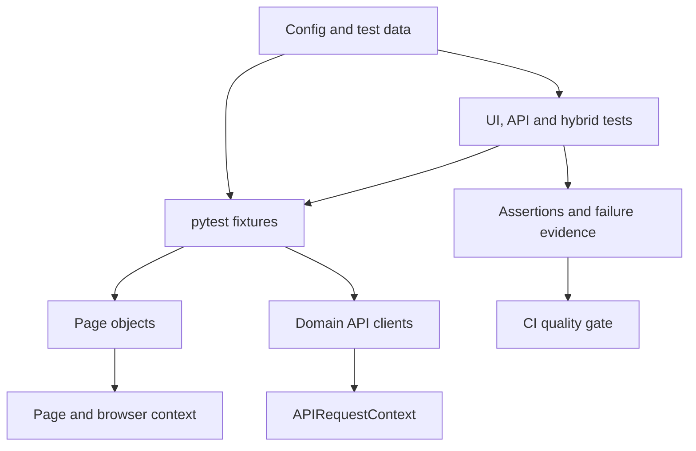

# Build a Playwright Python UI + API framework in five sessions

Prepared for Pranay Vighne. Start: 30 September 2026. Follow the next four sessions at your own pace; the dates below are the intended sequence, not scheduled reminders.

## How we will learn

Each session has one main deliverable. Use the cycle: understand the business requirement, sketch the design, write a small test, run it, deliberately break something, diagnose it, fix it, explain it, commit and push. Aim for about 90-120 minutes per session. If a step is unfinished, complete it before adding the next abstraction.

The supplied archive is a Day 1 starter. Days 2-5 are exercises and acceptance criteria, not already-completed code. You will gradually earn the final architecture instead of copying a large framework whose parts you cannot explain.

We will test Toolshop, the same practice application used by your handbook:

- UI: https://practicesoftwaretesting.com
- API: https://api.practicesoftwaretesting.com
- Swagger: https://api.practicesoftwaretesting.com/api/documentation

UI and API share the same product domain, which lets us compare their behavior later. Public data may change: do not assert an exact catalogue count or paste a product ID from one run into tomorrow's test.

## What I found in your PDF

The 110-page handbook is more than a TypeScript reference. Relevant printed PDF pages and chapters include:

| Topic | Handbook reference | How we use it |
| --- | --- | --- |
| Python and pytest | Part 4, roughly pages 17-23 | `def`, imports, classes, `self`, dictionaries, fixtures, `yield`, marks and parameterization |
| POM and fixtures | Parts 11-12 | Separate page actions from test assertions; compose setup with fixtures |
| Test data | Part 14 | Keep stable examples in JSON; generate unique mutable resources and clean up what we own |
| API and hybrid tests | Parts 15-18 | Request contexts, response validation, API/UI comparison and mocking |
| Execution and troubleshooting | Parts 19-23 | Isolation, parallel workers, debugging, traces, reports and configuration |
| Framework design | Part 24 | Add layers when they solve a real maintenance problem |
| Python UI project | Part 31, begins on page 87 | Python POM, test-ID configuration and authentication lessons |
| Python API project | Part 32, begins on page 92 | API clients, response schemas and pytest fixtures |
| CI and Git | Parts 34-36 | Pipeline checks, failure artifacts and a maintainable repository |
| VS Code and AI assistance | Parts 37-38 | Python debugging and instructions for reviewed AI-generated changes |

The PDF's curriculum lists Parts 39-44, but this attached edition ends with Part 38. We will use current official documentation for later AI tooling. The `projects/` paths described by the book are references to its author's files; those directories were not included in the PDF attachment.

## Translate the architecture, not the TypeScript syntax

| TypeScript habit | Our Python equivalent |
| --- | --- |
| `@playwright/test` runner | `pytest` with `pytest-playwright` |
| `playwright.config.ts` | `pytest.ini`, `config/settings.py` and fixture overrides in `conftest.py` |
| `test('...', async ({ page }) => ...)` | `def test_...(page: Page) -> None:` |
| `await page.getByRole(...)` | `page.get_by_role(...)` with the sync API |
| `test.extend(...)` | `@pytest.fixture` and fixture dependencies |
| `beforeEach` / `afterEach` | A function-scoped fixture with setup before `yield`, cleanup after it |
| `request` fixture | Our custom `api_context` fixture using `playwright.request.new_context()` |
| `expect(locator).toBeVisible()` | `expect(locator).to_be_visible()` |
| `locator.first()` / `response.status()` | `locator.first` / `response.status` properties |
| `test.step(...)` | Small named helpers plus logging/reporting; pytest has no automatic identical runner feature |
| `workers` configuration | `pytest-xdist` with `-n`, introduced after isolation is proven |
| TS interfaces/Zod | Python type hints and later Pydantic response models |
| `package-lock.json` | Pinned Python dependency file initially; `uv.lock` is a possible later migration |
| Node runner `--ui` / projects | Python Testing panel, Inspector and pytest browser options |

We intentionally use `playwright.sync_api` first. A test runs one action after another without `await`. Parallel tests can still run in separate processes later. Do not mix async Playwright objects with sync pytest fixtures.

## The architecture we are working toward

Tests express the scenario and expected result. Fixtures prepare the objects and clean them up. Page objects hide UI interaction details; API clients hide endpoint and request details. Configuration supplies environment values. Test data supplies scenario values. Reports explain failures. CI runs these same checks for every proposed change.

| Layer | Planned files | Owns | First needed |
| --- | --- | --- | --- |
| Test layer | `tests/ui/`, `tests/api/`, `tests/hybrid/` | Scenarios and assertions | Day 1, hybrid Day 4 |
| Fixture layer | Root and later scoped `conftest.py` files | Lifecycle, dependency injection, isolation and cleanup | Day 1 |
| Environment config | `config/settings.py`, `.env.example` | UI/API base URLs and runtime options | Day 1 |
| Runner config | `pytest.ini` | Discovery, marks, tracing and screenshot flags | Day 1 |
| UI layer | `pages/catalog_page.py`, `pages/product_page.py`, `pages/cart_page.py` | Locators and meaningful actions | Days 2 and 4 |
| API transport | `api/api_client.py` | Shared request behavior and sanitized request diagnostics | Day 3 |
| API domain | `api/products_api.py`, later `api/carts_api.py` | Product/cart endpoint methods | Days 3 and 4 |
| Response models | `models/product.py` | Runtime response shape/type validation | Day 3 |
| Stable datasets | `data/search_cases.json` | Search inputs, case IDs and expected behavior | Day 2 |
| Data factories | `factories/`, only when we create resources | Fresh payloads and unique IDs | Day 4 if needed |
| Helpers | `utils/` when duplication appears | Data loading, redacted logging and artifact helpers | Days 2-5 |
| AI assistance | `docs/ai_assisted_workflow.md`, later repo instruction files | Scenario drafting, reviewed changes and explanation | Starts Day 1, integrated Day 5 |
| CI | `.github/workflows/tests.yml` | Install, lint, smoke tests, exit status and artifacts | Day 5 |

Avoid a generic BasePage that wraps every Playwright method. A small page object with useful actions is easier to learn and maintain. Avoid adding folders with no job yet. Shared UI components should use composition when it helps.

## Session 1 - 30 September: make the two surfaces runnable

**Main task:** run one real UI smoke test and one real API smoke test, explain their fixture lifecycles, and commit the working foundation.

- Python focus: imports, functions, type hints, dictionaries, `assert`, decorators and `yield`.
- Files: dependencies, `pytest.ini`, `config/settings.py`, `.env.example`, `conftest.py`, two test files and VS Code settings.
- UI check: the catalogue has a Toolshop title and a visible product card.
- API check: GET `/products` has HTTP 200, a non-empty `data` list and basic product fields.
- Debugging: break at `response.json()` and inspect the response; record a passing UI trace; temporarily introduce a wrong title expectation and diagnose the failure.
- Brainstorm: where do URLs belong, why is `page` isolated, why is the API context separate, and what evidence proves the business behavior?
- Commit: `Day 1: add Playwright Python UI and API smoke tests`.

**Done when:** both smoke tests pass on your computer, you have opened a trace, restored your intentional failure, and can explain the code without reading it line by line. See `day_01.md`.

## Session 2 - 1 October: make UI tests maintainable

**Main task:** refactor the catalogue test into a POM and add data-driven product search tests.

- Python focus: `class`, `__init__`, `self`, `Path`, JSON and `@pytest.mark.parametrize`.
- Create `CatalogPage` with `open()`, `search(term)` and a `products` locator. Verify the live locator for the search field and search button in Inspector before using it.
- Add a `catalog_page` fixture; the test asks for the page object as a parameter.
- Store cases in `data/search_cases.json`, with unique IDs and business expectations. Include a known matching term, a term with no results and a whitespace/boundary case after clarifying how the app should handle it.
- Keep assertions in tests. Use `expect()` for values that change while the page renders.
- Debugging: deliberately use one wrong selector, diagnose the timeout, then change the selector in one POM file.
- Brainstorm: when would a page object help, what should a reusable action guarantee, and which inputs belong in JSON?
- Commit: `Day 2: add catalogue POM and data-driven search tests`.

**Done when:** each dataset record appears as a separate pytest result; editing a locator requires one page-object change; no fixed sleeps are needed. Prefer verified behavior over inventing expectations from a case name.

## Session 3 - 2 October: build the API layer

**Main task:** introduce reusable product API methods and a meaningful positive/negative contract suite.

- Python focus: classes, dictionaries, exceptions and runtime model validation.
- Add a thin `ApiClient` over `APIRequestContext` and a `ProductsApi` with `list_products()` and `get_product(product_id)`. Keep endpoint details there and assertions in the tests.
- Add a Pydantic `Product` model for fields the tests rely on. Python type hints alone do not validate received JSON at runtime.
- Capture a valid product ID from the list response; never hard-code an ID observed yesterday.
- Add a missing-product case using a verified syntactically valid ID that is not present. Confirm its expected status against Swagger and actual behavior.
- Add explicit HTTP status, response-body and schema checks. Preserve raw responses where negative tests need to examine failure details.
- Debugging: observe the difference between an HTTP error response and an exception from a network timeout.
- Brainstorm: who chooses expected status codes, what is a schema check, and when would a transport retry hide a defect?
- Commit: `Day 3: add product API clients and contract validation`.

**Done when:** tests use the domain client, cover at least one real negative case and report the failing check clearly. Do not retry assertion failures until they pass.

## Session 4 - 3 October: connect API data with a UI cart flow

**Main task:** select a current in-stock product through the API, open that product in the UI, add it to a cart, and compare identity and price with the API response.

- Python focus: fixture composition, small data models, optional factories and cleanup.
- Add `ProductPage` and `CartPage`. Verify the real product URL and cart behavior before writing methods.
- Use a fresh browser context and a fresh cart for each test. Pass product data from a fixture; do not share a mutable global dictionary.
- Parse prices with an appropriate currency/decimal representation instead of comparing loosely formatted strings or binary floats.
- If we introduce accounts or API-created carts, track ownership and use a cleanup fixture for supported deletion. Inspect Swagger first: do not assume every resource has a DELETE endpoint. Do not clean up shared demo users or another test's resources.
- Add `pytest-xdist` only after isolation works. Session fixtures run once per worker, not once globally across all workers.
- Debugging: inspect the UI/network trace to identify whether a mismatch comes from data selection, UI rendering or cart behavior.
- Brainstorm: which checks should remain API-only, what does this hybrid flow prove, and what can collide with two workers?
- Commit: `Day 4: add isolated API-to-UI product and cart validation`.

**Done when:** the hybrid flow uses current API data, cart tests pass independently and, if parallelism is enabled, the same tests pass with two workers.

## Session 5 - 4 October: make the repo reviewable in CI and use AI carefully

**Main task:** run the same smoke suite in GitHub Actions and complete one reviewed AI-assisted test change.

- Add lint checks and lock their dependencies deliberately. Type checking can start with the model/client boundary.
- GitHub Actions: checkout, setup Python, install pinned requirements, install Chromium and its Linux dependencies, run lint, run the smoke suite, upload JUnit XML and failure evidence with `if: always()`.
- Let pytest's exit status decide the test gate. Do not suppress failures with `continue-on-error` or broad exception catches.
- Keep a short PR smoke suite and a broader regression command. Add scheduled CI only when you want it.
- Add repo instructions appropriate to your AI editor: for example, `AGENTS.md` for an agent that reads it or `.github/copilot-instructions.md` for Copilot. A markdown file is an instruction source, not automatically an executable agent or pytest plugin.
- AI task: draft search/cart edge cases, choose one, ask for a minimal Python patch, review its selectors and assertions, run it, and document why it is useful.
- Debugging: introduce a failing expectation on a temporary branch, inspect the uploaded evidence and restore the assertion.
- Commit: `Day 5: add CI smoke gate and reviewed AI-assisted workflow`.

**Done when:** CI passes on your intended GitHub branch, an intentional failure produces useful artifacts, and you can explain the AI-generated change and its business assertion.

## Maintain test data deliberately

| Kind of value | Store/use it where | Example |
| --- | --- | --- |
| Environment setting | `.env` locally, environment values/Secrets in CI | UI/API URLs, token if a later flow needs one |
| Public template | Committed `.env.example` | Variable names and non-sensitive defaults |
| Stable scenario data | Versioned JSON dataset | Search term, case ID and expected behavior |
| Dynamic server identity | API response or setup fixture | Product ID and current cart ID |
| Unique mutable resource | Factory and cleanup fixture | Per-test account email or cart payload |
| Actual result | Test execution, not expected data | API body and the browser's visible value |
| Authentication state | Ignored temp/output directory | Cookies and storage state |
| Failure evidence | Ignored local output or access-controlled CI artifact | Trace, screenshot, sanitized request details |

Never overwrite the expected result with the actual result just to get a passing test. Keep expected behavior grounded in a requirement, a business rule or the contract.

## AI-assisted testing in this project

AI helps brainstorm cases, explain Python, propose page-object extraction and analyze trace evidence. You remain responsible for the test oracle: the assertion that tells us whether the behavior is correct.

Use `ai_assisted_workflow.md` for prompts. We will not add an LLM API call to every UI/API test. This is testing an e-commerce app with AI assistance; DeepEval is a separate concern when the application actually exposes an LLM feature.

The official planner/generator/healer documentation currently targets Playwright Test and its Node runner. Treat it as a tooling reference, not a drop-in Python pytest configuration. Python-compatible AI assistance can be ordinary editor/agent suggestions plus reviewed pytest code. If we add MCP, it can help inspect the practice site while the executable tests remain Python; MCP itself does not provide a test assertion or CI gate.

## Daily completion note

After each session, fill in `learning_log.md`:

1. One behavior tested and why it matters.
2. One Python/Playwright concept learned.
3. One failure reproduced and its evidence.
4. One design decision and the reason.
5. Test command and result, commit SHA and push result.

Only mark a push complete after Git reports success. If you send the repository URL, we can review the actual code and use its current state to choose the next patch.

## Official reference shelf

- [Playwright Python installation](https://playwright.dev/python/docs/intro)
- [pytest plugin, fixture scopes and artifact options](https://playwright.dev/python/docs/test-runners)
- [API testing and request-context cleanup](https://playwright.dev/python/docs/api-testing)
- [Page object models](https://playwright.dev/python/docs/pom)
- [Inspector and PWDEBUG](https://playwright.dev/python/docs/debug)
- [Trace Viewer](https://playwright.dev/python/docs/trace-viewer-intro)
- [Python testing in VS Code](https://code.visualstudio.com/docs/python/testing)
- [Playwright Test Agents](https://playwright.dev/docs/test-agents)
- [Toolshop's own source/reference](https://github.com/testsmith-io/practice-software-testing)
